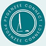

<a name="readme-top"></a>

[![Contributors][contributors-shield]][contributors-url]
[![Forks][forks-shield]][forks-url]
[![Stargazers][stars-shield]][stars-url]
[![Issues][issues-shield]][issues-url]
[![MIT License][license-shield]][license-url]
[![LinkedIn][linkedin-shield]][linkedin-url]


<!-- PROJECT LOGO -->
<br />
<div align="center">
  <a href="https://github.com/pygenzee/challenges">
    
  </a>

  <h3 align="center">PyGenZee Connect Challenges</h3>

  <p align="center">
    An Iranian Generation Zee Programmers, specially Python Programmers
    <br />
    <a href="https://t.me/pygenzee"><strong>Telegram Channel »</strong></a>
    <br />
    <br />
    <a href="https://github.com/pygenzee/challenges">View Challenges</a>
    ·
    <a href="https://github.com/pygenzee/challenges/issues/new?labels=bug&template=bug-report---.md">Report Bug</a>
    ·
    <a href="https://github.com/pygenzee/challenges/issues/new?labels=enhancement&template=feature-request---.md">Request Feature</a>
  </p>
</div>


<!-- TABLE OF CONTENTS -->
<details>
  <summary>Table of Contents</summary>
  <ol>
    <li>
      <a href="#about-the-project">About The Project</a>
      <ul>
        <li><a href="#built-with">Built With</a></li>
      </ul>
    </li>
    <li>
      <a href="#getting-started">Getting Started</a>
      <ul>
        <li><a href="#prerequisites--installation">Prerequisites & Installation</a></li>
        <li><a href="#usage">Usage</a></li>
      </ul>
    </li>
    <li><a href="#license">License</a></li>
    <li><a href="#contact">Contact</a></li>
  </ol>
</details>


<!-- ABOUT THE PROJECT -->
## About The Project

There are many great Programming courses and communities; however, I didn't find one that really suited my needs so I created this community. I want to create a community so amazing that it'll be the last one you ever need -- I think this is it.

Here's why:
* You need to know yourself deeply to be focused on your potentials. A kind of self-knowledge that works for programmers.
* Before programming, you need to know enough about human relationships and why each person makes choices.
* Your programs should be developed by a wise human that wise human user could participate effectively on it. :smile:
* All of these are essences of technical part and whyness of our challenges.

Of course, no one will serve all aspects of programming since your needs may be different. So I'll be adding more in the near future. You may also suggest changes by forking this repo and creating a pull request or opening an issue. Thanks to all the people have contributed to expanding these challenges!

Use the `BLANK_README.md` to get started.

<p align="right">(<a href="#readme-top">back to top</a>)</p>


### Built With

* [](https://www.python.org/)

<p align="right">(<a href="#readme-top">back to top</a>)</p>


<!-- GETTING STARTED -->
## Getting Started

Python is an easy to learn, powerful programming language. It has efficient high-level data structures and a simple but effective approach to object-oriented programming. Python’s elegant syntax and dynamic typing, together with its interpreted nature, make it an ideal language for scripting and rapid application development in many areas on most platforms.

### Prerequisites & Installation

Install Python interpreter and Git on your computer system. then follow these steps:

1. Create a virtual Environment
  ```sh
  python venv .venv
  ```
1. Activate your virtual Environment
  ```sh
  source .venv/scripts/activate
  ```
3. Clone the repo
   ```sh
   git clone https://github.com/pygenzee/challenges.git
   ```
4. Install PyPi packages
   ```sh
   pip install -r requirements.txt
   ```


<p align="right">(<a href="#readme-top">back to top</a>)</p>


<!-- USAGE -->
### Usage

After installation you can run all codes by:
* Executing python file with interpreter
  ```sh
  python src/[filename].py
  ```

<p align="right">(<a href="#readme-top">back to top</a>)</p>


<!-- LICENSE -->
## License

Distributed under the MIT License. See `LICENSE.txt` for more information.

<p align="right">(<a href="#readme-top">back to top</a>)</p>


<!-- CONTACT -->
## Contact

Dr. M.Saeed - [@mp_saeed](https://t.me/pygenzee) - pygenzeeconnect@gmail.com.com

Project Link: [https://github.com/pygenzee/challenges](https://github.com/pygenzee/challenges)

<p align="right">(<a href="#readme-top">back to top</a>)</p>


<!-- MARKDOWN LINKS & IMAGES -->
<!-- https://www.markdownguide.org/basic-syntax/#reference-style-links -->
[contributors-shield]: https://img.shields.io/github/contributors/othneildrew/Best-README-Template.svg?style=for-the-badge
[contributors-url]: https://github.com/pygenzee/challenges/graphs/contributors
[forks-shield]: https://img.shields.io/github/forks/othneildrew/Best-README-Template.svg?style=for-the-badge
[forks-url]: https://github.com/pygenzee/challenges/network/members
[stars-shield]: https://img.shields.io/github/stars/othneildrew/Best-README-Template.svg?style=for-the-badge
[stars-url]: https://github.com/pygenzee/challenges/stargazers
[issues-shield]: https://img.shields.io/github/issues/othneildrew/Best-README-Template.svg?style=for-the-badge
[issues-url]: https://github.com/pygenzee/challenges/issues
[license-shield]: https://img.shields.io/github/license/othneildrew/Best-README-Template.svg?style=for-the-badge
[license-url]: https://github.com/pygenzee/challenges/blob/master/LICENSE.txt
[linkedin-shield]: https://img.shields.io/badge/-LinkedIn-black.svg?style=for-the-badge&logo=linkedin&colorB=555
[linkedin-url]: https://linkedin.com/in/othneildrew
[product-screenshot]: images/screenshot.png
